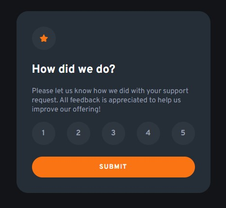
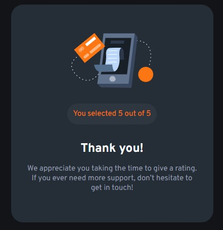

# Frontend Mentor - Interactive rating component solution

This is a solution to the [Interactive rating component challenge on Frontend Mentor](https://www.frontendmentor.io/challenges/interactive-rating-component-koxpeBUmI). Frontend Mentor challenges help you improve your coding skills by building realistic projects. 

## Table of contents

- [Overview](#overview)
  - [The challenge](#the-challenge)
  - [Screenshot](#screenshot)
  - [Links](#links)
- [My process](#my-process)
  - [Built with](#built-with)
  - [What I learned](#what-i-learned)
  - [Continued development](#continued-development)
- [Author](#author)
- [Acknowledgments](#acknowledgments)

## Overview

### The challenge

Users should be able to:

- View the optimal layout for the app depending on their device's screen size
- See hover states for all interactive elements on the page
- Select and submit a number rating
- See the "Thank you" card state after submitting a rating

### Screenshot




### Links

- Solution URL: [Github repository](https://github.com/RodrJavi/interactive-rating-component)
- Live Site URL: [Interactive rating preview](https://rodrjavi.github.io/interactive-rating-component/)

## My process

### Built with

- Semantic HTML5 markup
- CSS custom properties
- Flexbox
- Javascript
- Mobile-first workflow

### What I learned

This project helped me learn new styling methods to forms and more importantly how to pull values, use them, and change the styling of HTML properties with Javascript. I'm quickly becoming more comfortable and knowledgeable with HTML/CSS, this is my first attempt at using Javascript however and I am pleased with this code that the form uses.


```js
function submitForm(event) {
      let { score } = Object.fromEntries(new FormData(event.target))
      event.preventDefault();
      document.getElementById('confirmation').innerHTML = "You selected " + score +
       " out of 5";
      document.getElementById('rating-form').style.display = "none";
      document.getElementById('thank-message').style.display = "flex";
    }

    const ratingForm = document.getElementById("rating-form");
    ratingForm.addEventListener("submit", submitForm);
```

### Continued development

I will continue to focus on learning how to implement Javascript into future projects to become more familiar and proficient with it so it can be an essential and comfortable tool in any web development projects I pursue.

## Author

[Javier's Github](https://github.com/RodrJavi)


## Acknowledgments

Jacob Long's eagerness to help me practice and dive into Javascript has led me to beginning this project. His teaching methods allow me to learn from my mistakes as well as not be afraid to try all of my options before lending a hand or hint so that I can progress while still learning.

His github can be found [here](https://github.com/Jclong98)